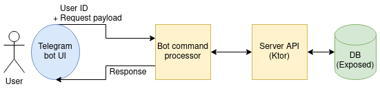

# Event guest tracker

Данный проект нацелен на покрытие потребности в простом учете людей на каком-либо мероприятии.
В начальном варианте ожидается, что пользователю будет доступен выбор события,
для которого он хочет провести регистрацию гостей. Событие может быть использовано в двух
режимах: создание списка гостей и регистрация пришедших людей.

Рассмотрим общую структуру реализации приложения на схеме:

Взаимодействие с пользователем будет осуществляться через телеграмм-бота.
Интерфейс приложения в телеграмм-боте позволит использовать его сразу, без установки куда-либо.
Таким образом, мы избавимся от проблемы совместимости и сложности установки на устройстве пользователя.

После получения все сообщения от пользователя поступают в обработчик команд, где они преобразуются в нужные
API запросы и отправляются на сервер. Такая декомпозиция позволяет отделить логику приложения от его интерфейса.
В таком случае бот может быть лишь одним из многих вариантов предоставления функционала пользователю. 
Реализация сервера будет выполнена с использованием фреймворка [Ktor](https://ktor.io/). Для хранения
данных будет использована одна из популярных БД и фреймворк [Exposed](https://github.com/JetBrains/Exposed) для
взаимодействия с ней.
